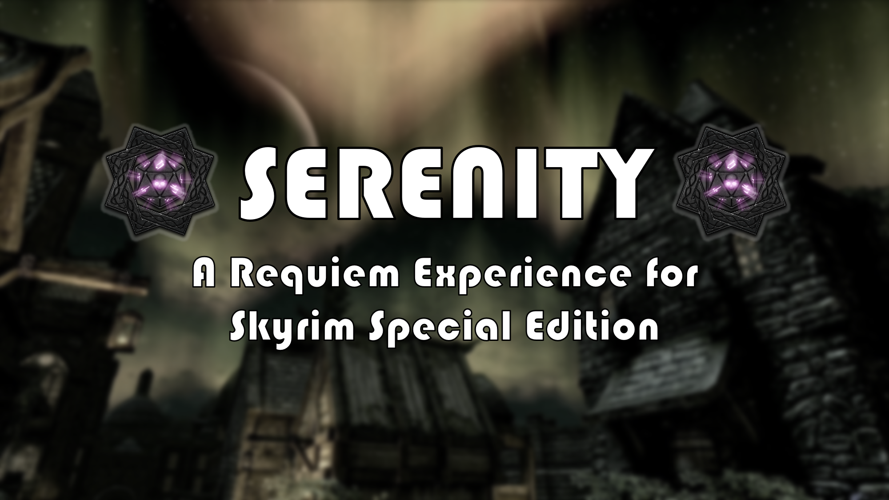

# Serenity 2

- [Serenity 2](#serenity-2)
  - [Preamble](#preamble)
  - [System Requirements](#system-requirements)
  - [Installation](#installation)
    - [Pre-Installation](#pre-installation)
      - [Installing Microsoft Visual C++ Redistributable Package](#installing-microsoft-visual-c-redistributable-package)
      - [Steam Config](#steam-config)
        - [Disable the Steam Overlay](#disable-the-steam-overlay)
      - [Change Steams Update Behavior](#change-steams-update-behavior)
      - [Set the Game language to English](#set-the-game-language-to-english)
      - [Clean Skyrim](#clean-skyrim)
      - [Start Skyrim](#start-skyrim)
    - [Using Wabbajack](#using-wabbajack)
      - [Preparations](#preparations)
      - [Downloading and Installing](#downloading-and-installing)
        - [Problems with Wabbajack](#problems-with-wabbajack)
  - [Post-Installation](#post-installation)
    - [ENB](#enb)
  - [Noteworthy Mods](#noteworthy-mods)
    - [Requiem](#requiem)
    - [Quest and Encounter Mods](#quest-and-encounter-mods)
    - [Expanded Cities Towns and Villages](#expanded-cities-towns-and-villages)
    - [Followers](#followers)
    - [Audio and Weather](#audio-and-weather)
    - [New Equippables](#new-equippables)
  - [How to start up Serenity](#how-to-start-up-serenity)
  - [Updating](#updating)
  - [Creating your Character](#creating-your-character)
  - [In-Game MCM Options](#in-game-mcm-options)
    - [Optional Survival Config](#optional-survival-config)
  - [Other Post Installation FAQ](#other-post-installation-faq)
    - [Ultrawide Options](#ultrawide-options)
    - [Tweaking the Game Settings](#tweaking-the-game-settings)
    - [Zoomed in Display](#zoomed-in-display)
    - [Removing the Modlist](#removing-the-modlist)
  - [Credits and Thanks](#credits-and-thanks)
  - [Contact](#contact)
  - [Contributing](#contributing)
  - [Changelog](#changelog)

## Preamble

Serenity 2 is a Skyrim SE modlist found on Wabbajack that aims to bring a fresh Requiem Experience to the table. It uses Requiem 4.0.1 converted to Skyrim Special Edition and has minor and some major tweaks to the core Requiem experience that aims to enhance longevity and replayability while keeping the game fair, balanced and looking great. Serenity is targetted at new and veteran Requiem players and can offer new experiences to both sides of the playerbase.

## System Requirements

Serenity is a mid to high end list in terms of graphics. A minimum of 6GB VRAM is required to play smoothly (60fps) on 1080p and 8GB VRAM to play smoothly (60fps) on 1440p

I made this list with my specs in mind and I am able to get 60FPS in riverwood and whiterun outdoors with Silent Horizon's ENB using the Game Ambient Occlusion settings with these specs

CPU: Ryzen 7 3700x
GPU: MSI Gaming X Trio Nvidia RTX 2070 Super
RAM: 4x8 3200Mhz G-Skill RAM
SSD: Crucial M1 1TB NVME SSD

## Installation

### Pre-Installation

These steps are only needed if you install this Modlist for the first time. If you update the Modlist, jump straight to [Updating](#updating).

#### Installing Microsoft Visual C++ Redistributable Package

I doubt you need to do this since you likely already have this installed. The package is required for MO2 and you can download it from [Microsoft](https://support.microsoft.com/en-us/help/2977003/the-latest-supported-visual-c-downloads). Download the x64 version under "Visual Studio 2015, 2017 and 2019". [Direct link](https://aka.ms/vs/16/release/vc_redist.x64.exe) if you can't find it.

#### Steam Config

##### Disable the Steam Overlay

The Steam Overlay can cause issues with ENB and is recommended to be turned off.

Open the Properties window (right click the game in your Library->Properties), navigate to the _General_ tab and un-tick the _Enable the Steam Overlay while in-game_ checkbox.

#### Change Steams Update Behavior

SSE is still being updated by Bethesda (they only add Creation Club content). Whenever the game updates, the entire modding community goes silent for the next one or two weeks because some mods need to be updated to the latest game runtime version.

To ensure that Steam does not automatically updates the game for you, head over to the Properties window, navigate to the _Updates_ tab and change _Automatic updates_ to _Only update this game when I launch it_. You should also disable the Steam Cloud while you're at it.

#### Set the Game language to English

Just do it. This entire Modlist is in English and 99% of all mods you will find are also in English. I highly recommend playing the game in English and **I will not give support to people with a non-English game**.

Open the Steam Properties window, navigate to the _Language_ tab and select _English_ from the dropdown menu.

#### Clean Skyrim

I highly recommend uninstalling the game through Steam, deleting the game folder and reinstalling it. Alternatively you can use [Skyrim Shredder](https://www.nexusmods.com/skyrimspecialedition/mods/30133) to remove everything modding related from your Skyrim folder. You should also clean up the `Skyrim Special Edition` folder in `Documents/My Games/` by deleting the contents in it.

#### Start Skyrim

After you have done everything above and got a clean SSE installation ready, start the Launcher and and let it do the initial graphics check. Do not worry about this part as the installation will replace this graphics settings.
Start the game and exit once you're in the main menu.

### Using Wabbajack

#### Preparations

Grab the latest release of Wabbajack from [here](https://github.com/wabbajack-tools/wabbajack/releases) and place the `Wabbajack.exe` file in a _working folder_. This folder **must not** be in a _common folders_ like your Desktop, Downloads or Program Files folder. It's best to create a Wabbajack folder near the root level of your drive like `C:/Wabbajack`.

#### Downloading and Installing

The download and installation process can take a very long time depending on your system specs. Wabbajack will calculate the amount of threads it will use at the start of the installation. To have the highest amount of threads and thus the fastest speed, it is advised to have the working folder on an SSD.

1. Open Wabbajack
2. Click on Browse Modlists, and download Serenity from the gallery.
3. Once the download is done set the Installation folder to somewhere that is not affected by UAC (Please do not put it in Documents, Program Files, Desktop. Put it somewhere easy like `C:/Modlists/Serenity`). The downloads path should automatically fill in the installation path.
4. Click the Go/Begin button
5. Wait for Wabbajack to finish
6. If you run into any issues see the next section. If the installation is successful, proceed to [Post-Installation](#post-installation).

##### Problems with Wabbajack

There are a lot of different scenarios where Wabbajack will produce an error. I recommend re-running Wabbajack before posting anything. Wabbajack will continue where it left off so you loose no progress.

**Could not download x**:

If a mod updated and the old files got deleted, it is impossible to download them. In this case just wait till I update the Modlist.

**x is not a whitelisted download**:

This can happen when I update the modlist. Check if a new update is available and wait if there is none.

**Wabbajack could not find my game folder**:

Wabbajack will not work with a pirated version of the game. If you own the game on Steam, go back to the [Pre-Installation](#pre-installation) step.

**Windows is reporting that a virus has been detected**:

Windows 10 has started to auto quarantine the usvfs_proxy_x86.exe file from the latest version of Mod Organizer 2 saying a threat was detected . This is a known false postive confirmed by the MO2 Devs. You can fix this by adding an exemption for MO2 Folder to your Antivirus. Example for windows defender can be found [here](https://www.thewindowsclub.com/exclude-a-folder-from-windows-security-scan).

## Post-Installation

### ENB

Serenity comes with [Rudy ENB for Cathedral Weathers](https://www.nexusmods.com/skyrimspecialedition/mods/39113) included.

If you want a different ENB. You can choose from a wide variety of ENBs on the Nexus that support Cathedral Weathers. To replace the ENB installed. Delete the enbcache folder, enbseries folder, enbseries.ini and replace those with the new ENB. You don't have to delete the enblocal.ini as that contains tweaks that don't affect how it looks but rather things like screenshot formats, vsync settings.

A few other ENB suggestions are:

- [Serio's ENB](https://www.nexusmods.com/skyrimspecialedition/mods/30506)
- [Silent Horizons ENB](https://www.nexusmods.com/skyrimspecialedition/mods/21543)
- [Re-engaged ENB](https://www.nexusmods.com/skyrimspecialedition/mods/1089)

## Noteworthy Mods

### Requiem

[Requiem](https://www.nexusmods.com/skyrim/mods/19281) is a project with the goal of turning Skyrim into a better roleplaying experience by making game more immersive, semi-realistic and coherent, with the tend to find a compromiss between old school mechanics and more modern approaches.

Requiem is the core mod behind Serenity. It overhauls the entire game with regards to Races, Combat, Standing Stones, Dragons, Perks, Difficulty and much much more. Requiem offers an unleveled world in where everything is static and doesn't level with the player.

Serenity comes with a few modifications to Requiem. This includes but is not limited to:

- Magic Tweaks via [Requiem - Expanded Grimoire](https://www.nexusmods.com/skyrimspecialedition/mods/39214)
- Miscellaneous NPC Tweaks and NPC Vampire expansion via [Requiem - Small Tweaks](https://www.nexusmods.com/skyrimspecialedition/mods/42633)
- Religious overhaul via [Requiem - Immersive Divine Blessings](https://www.nexusmods.com/skyrim/mods/90691)
- Dragonborn Expansion is available through [Requiem - Dragonborn Patch](https://www.nexusmods.com/skyrimspecialedition/mods/34829)
- Unarmed Enhancement from the mod [Requiem - Unarmed Combat Enhancement](https://www.nexusmods.com/skyrimspecialedition/mods/42541)
- New Feats from [Requiem - Special Feats](https://www.nexusmods.com/skyrimspecialedition/mods/42588)

### Quest and Encounter Mods

Serenity comes with a wide variety of new quest and encounters. A few are listed below.

[Legacy of the Dragonborn](https://www.nexusmods.com/skyrimspecialedition/mods/11802) is a very large mod that shapes the way how you play the game. The museum is a very robust house mod with the ability to display almost every item in the game and also has an extensive mod support which is utilised to some extent in Serenity. Serenity also comes with a Requiem display room for it thanks to [pamposzek](https://www.nexusmods.com/skyrimspecialedition/mods/36998).

[Interesting NPCs](https://www.nexusmods.com/skyrimspecialedition/mods/29194) adds over 250 fully voiced NPCs, 25+ followers, 15+ marriage candidates and 50+ quests to fully flesh out the world of Skyrim. Every hold will feel more lively with more NPCs walking and talking with each other. For Balance reasons,all follower recruitment dialog has been disabled until you complete the Dragon Rising quest

[Missives](https://www.nexusmods.com/skyrimspecialedition/mods/17576?tab=files) adds a large number of localized radiant quests found at Missive Boards of varying difficulty and with varying rewards. Missives has been extended to Solstheim as well as Wyrmstooth.

### Expanded Cities Towns and Villages

Serenity uses the full suite of [JK's Skyrim](https://www.nexusmods.com/skyrimspecialedition/mods/6289) along with all of the interior patches for it.

### Followers

[Inigo](https://www.nexusmods.com/skyrimspecialedition/mods/1461) is a fully voiced khajiit adventuring companion with over 7000 lines of unique dialogue - much of it about you. He'll level alongside you and avoid most traps. If you're sneaking he won't chatter and he'll whisper if you talk to him. He can run out of arrows. He's highly skilled in archery, one-handed, and sneak. For balance reasons, all interaction dialog has been disabled until after the completion of Dragon Rising

[Lucien](https://www.nexusmods.com/skyrimspecialedition/mods/20035) is a fully voiced Imperial follower with around 3000 lines of immersive, lore-friendly dialogue. Though he arrives in Skyrim as a cowardly scholar, he'll gradually gain strength and confidence by your side until he grows into a hero in his own right.

### Audio and Weather

[Audio Overhaul Skyrim](https://www.nexusmods.com/skyrimspecialedition/mods/12466) and [Immersive Sounds Compendium](https://www.nexusmods.com/skyrimspecialedition/mods/523) offer an amazing base for skyrim's ambiance and foley.

### New Equippables

[aMidianBorn Armor Variants Lite](https://www.nexusmods.com/skyrimspecialedition/mods/45160) adds some armor variety from CaBal120's extra armor textures

[Cloaks of Skyrim](https://www.nexusmods.com/skyrimspecialedition/mods/6369) provides cloaks to various NPCs. For the purpose of balance and not to be overpowered with Requiem, the regular cloaks cannot be enchanted and the pre-enchanted cloaks have been toned down a level or two.

[Heavy Armory](https://www.nexusmods.com/skyrimspecialedition/mods/6308) adds around 100 new weapons into the game that is evenly distributed to all the enemies and NPCs.

## How to start up Serenity

Head over to the installation folder and locate an executable named `ModOrganizer.exe` and launch it. Once its launched there will be a dropdown box on the top right and a big run button next to it. Ensure it is set to SKSE by selecting it in the dropdown box and then hitting the run button.

## Updating

If this Modlist receives an update please check the Changelog before doing anything. Always backup your saves or start a new game after updating.

**Wabbajack will delete all files that are not part of the Modlist when updating!**

This means that any additional mods you have installed on top of the Modlist will be deleted. Your downloads folder will not be touched!

Updating is like installing. You only have to make sure that you select the same path and tick the _overwrite existing Modlist_ button.

## Creating your Character

Upon entering the game you will be greeted with a notification from the Curator's Companion Mod. Hit OK and wait for another pop-up from it, usually takes about a minute.  Once it's done you can proceed with creating your character. Once you've named your character wait for all the messages in the top left to fade away then open your inventory and close it. This will start up Requiem. Once Requiem has finished its installation you may proceed with the game

## In-Game MCM Options

All the required MCM options have been automated for you. Enjoy the game or tweak the following to your liking:

- iHud
- AllGUD
- SkyUI
- Lucien (If you set a nickname that's supported he can call you by that name)
- XP32 Skeleton Styles

### Optional Survival Config

Included in Serenity is SunHelm Survival. It is already tweaked for Requiem Compatibility as well as a few game tweaks I use. It is disabled by default and will prompt to turn on when you sleep or if you manually activate it. If you're not a fan of this, just disable it in the MCM option. **DO NOT UNINSTALL THE MOD**

## Other Post Installation FAQ

### Ultrawide Options

If you have an ultrawide monitor (21:9), the UI will be off and look weird. You will want to install a set of mods meant to help with widescreen monitors

1) Head over to [Complete Widescreen Fix for Vanilla and SkyUI 2.2 and 5.2 SE](https://www.nexusmods.com/skyrimspecialedition/mods/1778)
2) Grab Complete Widescreen Fix for SkyUI 5.2 SE Alpha- 2560x1080 from the main files section
3) Under Optional File grab
   1) Better Dialogue Control Widescreen Fix
   2) Better MessageBox Control Widescreen Fix
   3) Campfire 1.12.1 and Frostall 3.4.1SE - Unofficial SSE Widescreen Fix
   4) Extended UI - Widescreen Fix
   5) Even Wider Rescaled MCM Menu for SkyUI - Widescreen Fix
   6) SkyHud - High Resolution Widescreen Fix
4) Install all of these mods and let them load at the bottom. You should now have a working UI with widescreen support

### Tweaking the Game Settings

I highly recommend using [BethINI](https://www.nexusmods.com/skyrimspecialedition/mods/4875) which is included in this Modlist (can be found in `MO2/tools/BethINI`). I recommend tweaking the `Detail` section for more FPS:

- `Shadow Resolution`: Very big one. A good balance is `2048` which is the borderline between high FPS drainage and garbage looking shadows.
- `Ambient Occlusion`: Highly recommended to turn either this or your ENB version off. Do not have the game AO and an ENB AO turned on at the same time.
- `Remove Shadows`: If you really struggle, use this. This will disable all Shadows (not recommended)

### Zoomed in Display

This can be caused by Window's Display Scaling feature. This usually is set to above 100% when using very large (32 inch++) sized monitors and TVs. There are two solutions to this

- Set the display scaling back to 100% in the Screen Resolution Settings for Windows
- Edit the mod SSE Display Tweaks.
  - Under `[Render]`
    - Set Fullscreen to `True`
    - Set Borderless to `False`

### Removing the Modlist

You can just remove the MO2 folder and be done with it. SKSE and ENB files will still be in your game folder so I recommend using [ENB and ReShade Manager](https://www.nexusmods.com/skyrimspecialedition/mods/4143) if you want to remove the ENB.

## Credits and Thanks

- _YOU_ for actually reading the readme. Thanks a ton!!
- erri120 & jdsmith2816 - Repository template
- Halgari and everyone the WJ Team - Wabbajack is awesome and so are you
- Phoenix from [The Phoenix Flavour](thephoenixflavour.com/) - Serenity is largely built upon her amazing guide

## Contact

While I'm always available on the [Wabbajack Discord](https://discord.gg/wabbajack) and on my own discord [Xanza's Emporium](https://discord.gg/867QtkVuUa), I would advise checking the [Issues](https://github.com/ixanza/serenity/issues) (open **and** closed ones) on GitHub first if you have any problems. The same goes for _Enhancements_ or _Feature/Mod Requests_. **DO NOT DM ME ON DISCORD. I WILL NOT PROVIDE SUPPORT FOR YOU IN DMS AND I WILL BLOCK YOU**.

## Contributing

See [Contributing](CONTRIBUTING.md).

## Changelog

See [Changelog](CHANGELOG.md).
